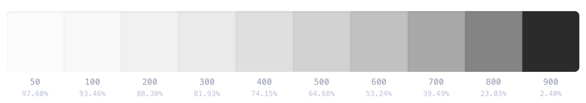

# .dianna (dot-files, identity)

You may or may not find this to be useful inspiration. In any case, it's my backup.

## installation

Idk, like, put it under your home directory, change some things, and make some symlinks.

## basic setup

- Z shell https://zsh.sourceforge.io
- Oh My Zsh https://ohmyz.sh
- Neovim https://neovim.io

Nothing fancy going on, as you can see.

## color scheme

All color schemes used in my setup were derived from a base ten color gray scale palette I'm calling 'left-shift', computed from luminance endpoints at 97.6 percent and 2.4 percent and biased towards increased contrast at darker colors for use in my (mostly) monochrome Neovim color scheme. A simple five color palette of imperial red, azure, light green, flax, and amethyst, with a additional lavender magenta and aquamarine accent colors, was developed using https://color.adobe.com (specifically, double split complementary color harmony) to select hues and https://grayscale.design/app to select the final colors locked to the base gray scale palette. I call this theme 'minimally.gay'.

### left-shift

```json
{
  "left-shift": {
    "grayscale": {
      "50": "#fcfcfc",
      "100": "#f8f8f8",
      "200": "#f1f1f1",
      "300": "#eaeaea",
      "400": "#dfdfdf",
      "500": "#d2d2d2",
      "600": "#c1c1c1",
      "700": "#999999",
      "800": "#848484",
      "900": "#2b2b2b"
    }
  }
}
```



### minmially.gay

```json
{
  "minmially.gay": {
    "palatte": {
      "imperial red": "#f04444",
      "azure": "#4880f0",
      "light green": "#a2f47c",
      "flax": "#f5ee90",
      "amethyst": "#9f65f1",
      "lavender magenta": "#f479f4",
      "aquamarine": "#70f5cb"
    }
  }
}
```

### minmially-soft.gay (light)

```json
{
  "minmially-soft.gay": {
    "palatte": {
      "melon": "#f8aeae",
      "jordy blue": "#a6c1f8",
      "tea green": "#dcfbce",
      "lemon chiffron": "#f8f4b7",
      "mauve": "#d1b5f8",
      "plumb": "#f7a4f7",
      "celeste": "#c7fbeb"
    }
  }
}
```


### minmially-256.gay (256 color approximation)

```json
{
  "minmially-256.gay": {
    "palatte": {
      "imperial red": "203",
      "azure": "69",
      "light green": "156",
      "flax": "228",
      "amethyst": "135",
      "lavender magenta": "213",
      "aquamarine": "86"
    }
  }
}
```


### minmially-soft-256.gay (light, 256 color approximation)

```json
{
  "minmially-soft-256.gay": {
    "palatte": {
      "melon": "217",
      "jordy blue": "147",
      "tea green": "194",
      "lemon chiffron": "229",
      "mauve": "183",
      "plumb": "219",
      "celeste": "195"
    }
  }
}
```

###


